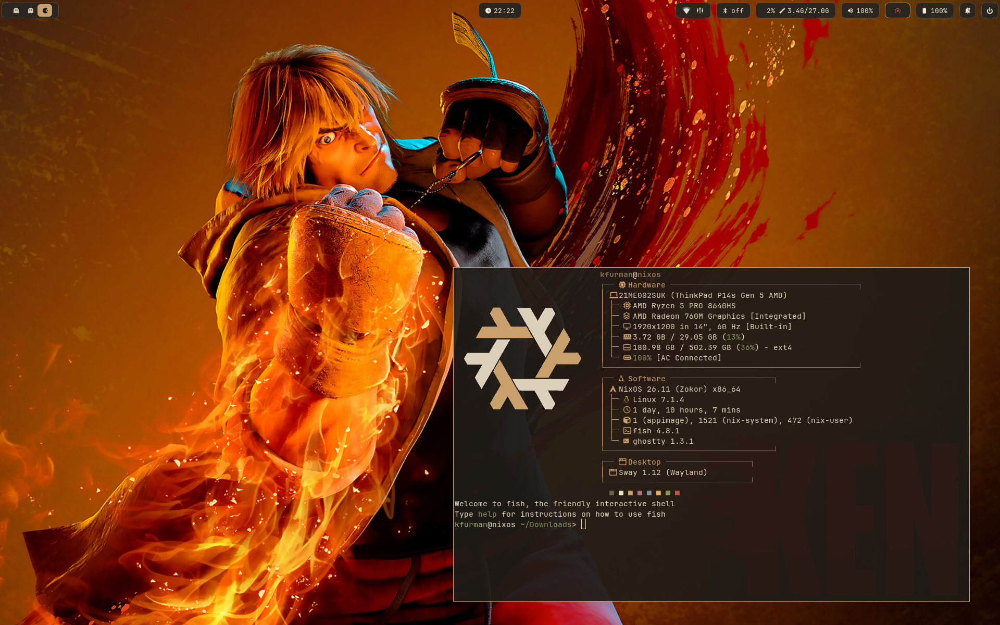

# nixos-setup

Declarative NixOS config: sway (tiling Wayland WM), Nord theme, Waybar, greetd login, and a Nix-managed dev toolchain (latest GCC for C++26, latest kernel). 

Neovim config is pinned as a flake input, shared with non-nix machines machines.



## Install (from the minimal NixOS installer)

Boot the minimal ISO. You start as user `nixos` (no password); prefix commands with `sudo` or run `sudo -i` for a root shell.

1. **Get online.** Wired DHCP connects automatically - test with `ping nixos.org`. 

   For wifi, the installer ships NetworkManager (this is the way the NixOS manual recommends):

   ```bash
   nmcli device wifi connect "YOUR_SSID" password "YOUR_PASSWORD"
   ```

   Then verify with `ping -c2 nixos.org`.

2. **Partition + format** the target disk (UEFI/GPT). 

   Replace `/dev/sdX` with your disk (`lsblk` to find it). The LABELs `boot`/`nixos` are what the placeholder hardware config expects:

   ```bash
   sudo -i
   lsblk                       # identify the target disk first

   # Wipe any existing partition table + filesystem signatures
   wipefs -a /dev/sdX
   sgdisk --zap-all /dev/sdX

   # GPT: 512MiB EFI system partition + rest for root
   parted /dev/sdX -- mklabel gpt
   parted /dev/sdX -- mkpart ESP fat32 1MiB 512MiB
   parted /dev/sdX -- set 1 esp on
   parted /dev/sdX -- mkpart primary 512MiB 100%

   # NOTE: NVMe names partitions p1/p2 (e.g. /dev/nvme0n1p1); SATA uses 1/2.
   mkfs.fat -F 32 -n boot /dev/sdX1
   mkfs.ext4 -L nixos /dev/sdX2
   ```

3. **Mount** (`umask=077` keeps the ESP root-only, per the NixOS manual):

   ```bash
   mount /dev/disk/by-label/nixos /mnt
   mkdir -p /mnt/boot
   mount -o umask=077 /dev/disk/by-label/boot /mnt/boot
   ```

4. **Clone this repo** (git is on the ISO):

   ```bash
   git clone https://github.com/krisfur/nixos-setup /mnt/etc/nixos-setup
   cd /mnt/etc/nixos-setup
   ```

5. **Generate this machine's hardware config** and stage it. 

   Flakes only see git-tracked files, so it must be `git add`ed (staging is enough - no commit needed) or `nixos-install` won't pick it up. 

   This is the one per-machine file; everything else is shared:

   ```bash
   nixos-generate-config --root /mnt --show-hardware-config \
     > hosts/nixos/hardware-configuration.nix
   git add hosts/nixos/hardware-configuration.nix
   ```

6. **Install:**

   ```bash
   nixos-install --flake '/mnt/etc/nixos-setup#nixos'
   reboot
   ```

After reboot, log in as `kfurman` with password `changeme` and immediately change it:

```bash
passwd
```

### Fingerprint reader (optional, hardware permitting)

On machines with a reader supported by [libfprint](https://fprint.freedesktop.org/supported-devices.html), enrol a finger:

```bash
fprintd-enroll        # touch the sensor repeatedly until it completes
fprintd-verify        # confirm it reads back
```

Check yours is on that list first — `lsusb` shows the vendor:product ID (Synaptics readers are vendor `06cb`). On machines without a reader, skip this: `fprintd-enroll` just reports no devices and nothing else is affected.

This covers `sudo` and `swaylock`. On the lock screen, press Enter on an *empty* password to hand over to the sensor; typing your password normally still unlocks instantly.

Console login and the greeter are deliberately left password-only — fprintd isn't reliably running that early in boot, and a greeter hanging on the sensor is a bad way to lose access.

One non-obvious bit in `modules/system/desktop.nix`: swaylock reorders `pam_fprintd` to run *after* `pam_unix` (`rules.auth.fprintd.order`). NixOS stacks it first by default, and because swaylock collects the password before running the PAM stack, that makes it block on the sensor for its full retry count before it even checks what you typed — slower than having no fingerprint at all.

Enrolment is per-user and stored outside the store in `/var/lib/fprint`, so it's one of the few steps that can't be declarative — repeat it on each machine.

## Apply changes later

The repo lives in root-owned `/etc`, so git runs need `sudo`:

```bash
sudo git -C /etc/nixos-setup pull
sudo nixos-rebuild switch --flake '/etc/nixos-setup#nixos'
```

To pull a newer neovim config (the pinned flake input):

```bash
sudo nix flake update neovim-config --flake /etc/nixos-setup
sudo nixos-rebuild switch --flake '/etc/nixos-setup#nixos'
```

## Update everything (like `dnf upgrade` / `pacman -Syu`)

Package versions are pinned by `flake.lock`. 

Updating = bumping the lock to the latest `nixos-unstable` (and other inputs), then rebuilding:

```bash
sudo nix flake update --flake /etc/nixos-setup     # bump flake.lock
sudo nixos-rebuild switch --flake '/etc/nixos-setup#nixos'
```

Commit the changed `flake.lock` afterward so the new versions are pinned/shared. 

`claude-code` is the exception: it's not in Nix (the read-only store breaks its
self-updater and nixpkgs trails upstream). A wrapper in `modules/home/home.nix`
(same pattern as the Helium browser) runs Anthropic's official installer on
first launch, dropping a self-updating native binary into `~/.local/bin` (run
via `nix-ld`). It self-updates in place after that — nothing to run by hand, and
`sudo nixos-rebuild switch` remains the only command you invoke.

To reclaim disk from old generations:

```bash
sudo nix-collect-garbage --delete-older-than 14d
```

To roll back a bad update, pick a previous generation in the boot menu, or:

```bash
sudo nixos-rebuild switch --rollback
```

## Add a package

System packages live in `modules/system/packages.nix` (desktop apps) or `modules/system/dev.nix` (dev tooling). 

Add the attribute name to the relevant list and rebuild. E.g. to add the Helix editor, in `packages.nix`:

```nix
  environment.systemPackages = with pkgs; [
    ghostty
    helix          # <- added
    ...
  ];
```

then:

```bash
sudo nixos-rebuild switch --flake '/etc/nixos-setup#nixos'
```

Find the exact attribute name with `nix search nixpkgs helix` or <https://search.nixos.org/packages>. Most apps are just the lowercase name.

## nix-shell

Sometimes you need an additonal dependency for a project and you don't want to add it globaly. 

For that in the project root create a simple `shell.nix` file like:

```nix
{ pkgs ? import <nixpkgs> {} }:

pkgs.mkShell {
  buildInputs = with pkgs; [
    odin
    raylib
  ];
}
```

source it with:

```bash
nix-shell
```

and when done exit with:

```bash
exit
```

## C++26

GCC 16.1 is system-wide, so `c++ -std=c++26` (incl. P2996 reflection) works anywhere with no per-project setup.

## Layout

```
flake.nix                      inputs, nixosConfiguration
hosts/nixos/                   host config + (placeholder) hardware-configuration.nix
modules/system/                core, desktop, dev, packages
modules/home/home.nix          home-manager: theming, git, vendored dotfiles
config/                        vendored dotfiles (sway, waybar, fuzzel, fastfetch, ...)
                               (neovim config comes from the neovim-config flake input)
```
